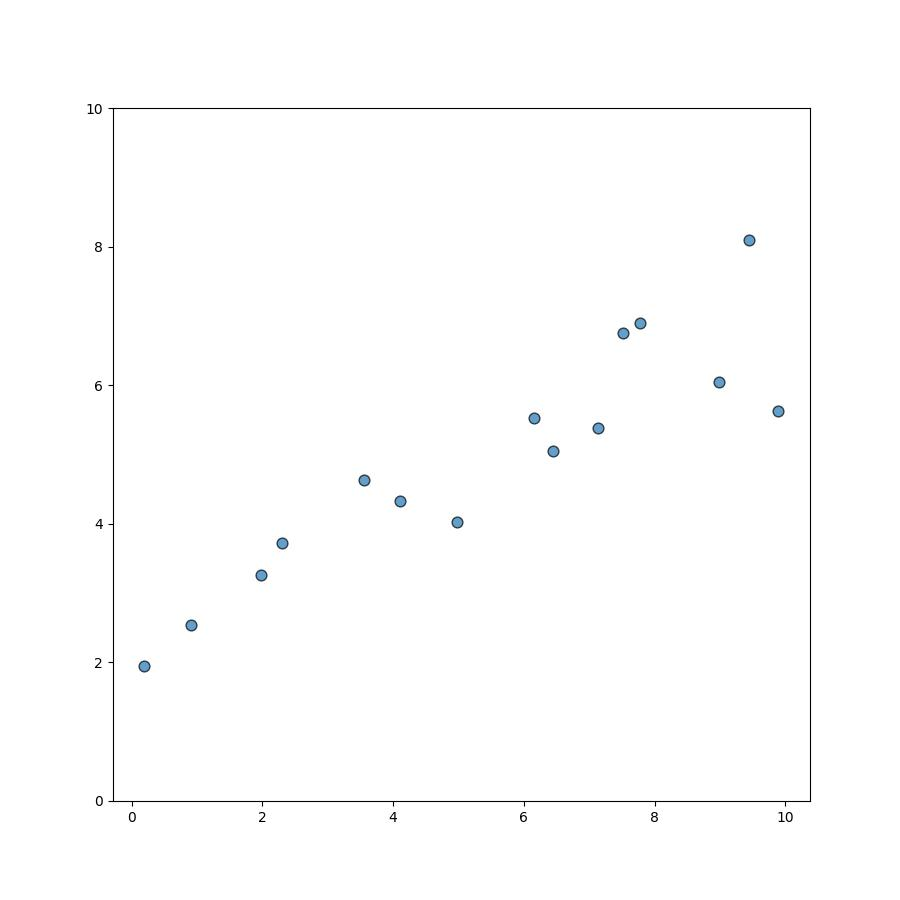
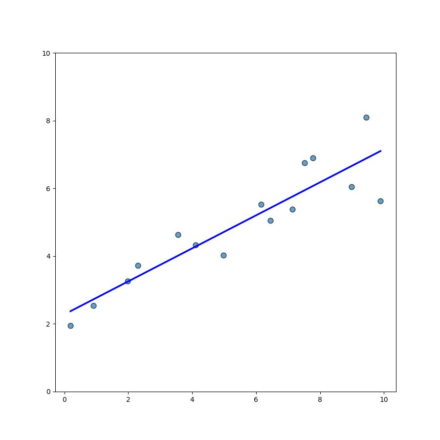
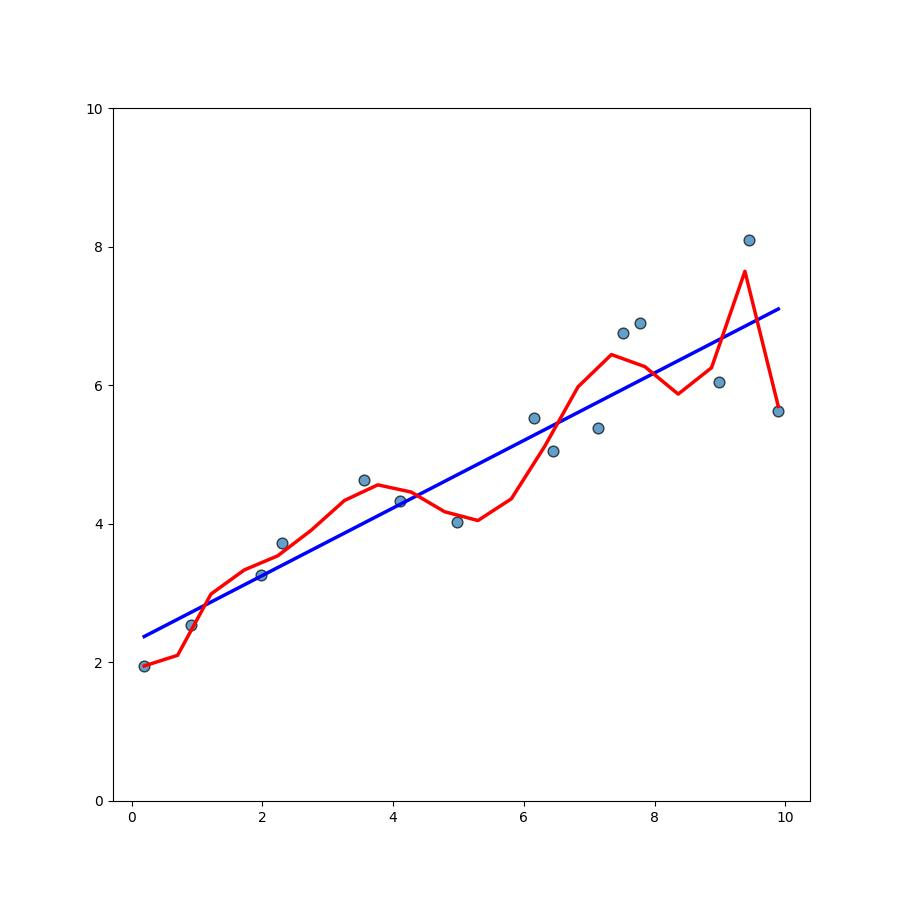
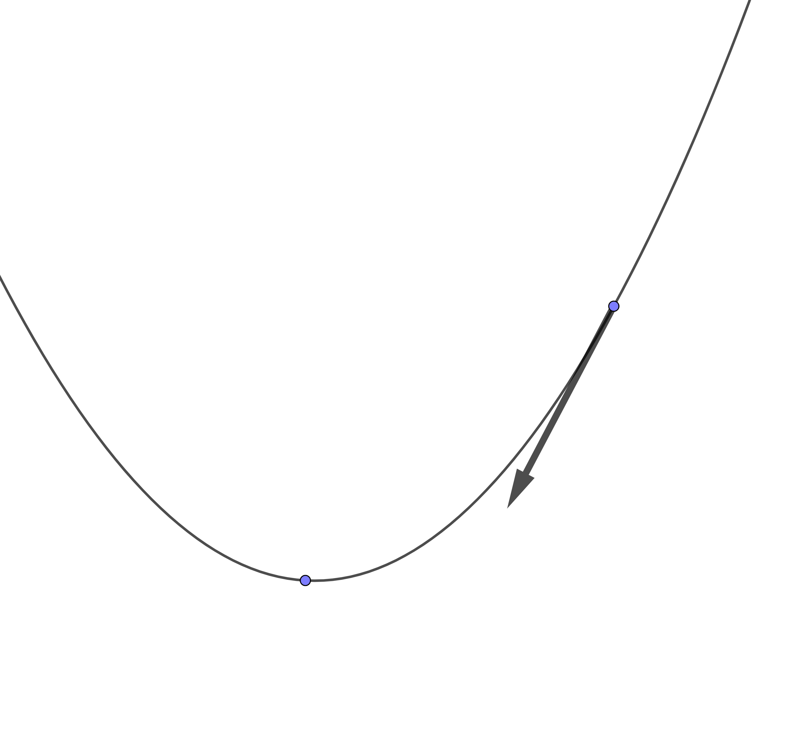
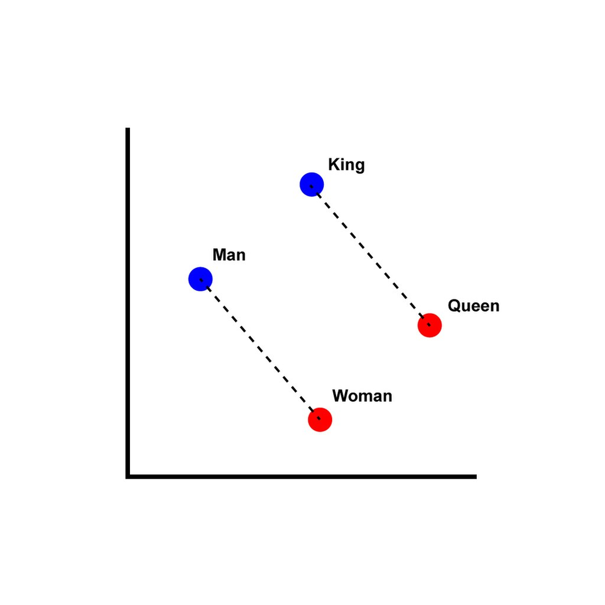
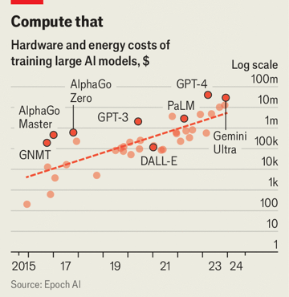

.center[
## View from the Frontier:  
### AI Use in Industry and Academia
]

 

.center[
Marlborough School Educator Workshops  
October 9, 2026
]

 

.center[

]

.center[
Darren Kessner, PhD  
_Program Head of Computer Science and Software Innovation_    
_Marlborough School, Los Angeles_  
]

---

     

.center[
### How are scientific researchers using AI in their work?
 
### How does this affect STEM education?
]

---

### Who Am I?

.split-40[
.column[
.center[
  
  
  
  

]
]

.column[
.center[
__Dr. Darren Kessner__
]

- BS, MA in Mathematics

- PhD in Bioinformatics

- Software developer for &gt;25 years  

 
.center[
__Marlborough School__
]

- Program Head of Computer Science and Software Innovation (12 years)

 
.center[
__Ellison Medical Institute__  
]

- Senior Software Engineer  
  AI and Advanced Molecular Medicine 

]
]

---

## 1. Scientific Applications

### 2. Background / Theory

### 3. Education / Curriculum

---

### Weather Prediction

__TODO__: update

- prediction improvments of up to 20%
- ~1000x decrease in energy use

https://www.ecmwf.int/en/about/media-centre/news/2025/ecmwfs-ai-forecasts-become-operational

---

### Mathematics

- Millenium problems
- Navier-Stokes
- Lean formalization

---

### Digital Pathology

__TODO__: update

computer vision -> digital pathology

https://news.harvard.edu/gazette/story/2024/09/new-ai-tool-can-diagnose-cancer-guide-treatment-predict-patient-survival/

---

### Personalized Medicine

__TODO__: update

https://www.science.org/content/article/gene-editing-therapy-made-just-6-months-helps-baby-life-threatening-disease

https://www.theguardian.com/society/2025/may/30/new-ai-test-can-predict-which-men-will-benefit-from-prostate-cancer-drug

---

### AlphaFold

__TODO__: update

Protein structure prediction

.split-50[

.column[

]

.column[

]

]

---

### Drug Discovery

__TODO__: update

https://www.technologyreview.com/2023/02/15/1067904/ai-automation-drug-development/

- drug discovery
    - alpha fold
    - evo genetic models
    - generative AI

---

### Software development

__TODO__: update

- agents / harnesses

---

### Science

__TODO__: update

- AI-directed experiments

---

### 1. Scientific Applications

## 2. Background / Theory

### 3. Education / Curriculum

---

### Linear regression

.split-60[

.column[

]
.column[
__Data__  
x: input  
y: output  
]

]

---

### Linear regression

.split-60[

.column[

]

.column[
__Data__  
x: input  
y: output  
  
__Model__  
line     
y = mx + b
  
__Parameters__   
m (slope)  
b (intercept)  

__Training / Learning__ 
finding the best parameters - 
minimizing a loss function

]
]

---

### Linear regression

.split-60[

.column[

]

.column[
__Data__  
x: input  
y: output  
  
__Model__  
line     
y = mx + b
  
__Parameters__   
m (slope)  
b (intercept)  

__Training / Learning__ 
finding the best parameters - 
minimizing a loss function

__Overfitting__  
using too many parameters

]
]

---

### Training the model

.split-50[

.column[

]

.column[
__Train the model__  

&nbsp; = learn from data

&nbsp; = find best parameters  

&nbsp; = minimize loss function  

 

__Gradient Descent__  

- give training data to model as input

- calculate gradient of loss function

- adjust parameters in the direction of the gradient

]
]

---

### Neural Networks

.split-60[

.column[

 
 

 
 
 
<small>
Image credits:
[1](https://commons.wikimedia.org/wiki/File:Neuron3.svg)
[2](https://commons.wikimedia.org/wiki/File:Artificial_neuron_structure.svg)
[3](https://commons.wikimedia.org/wiki/File:Colored_neural_network.svg)
</small>

]

.column[
 

.center[
weights == parameters

training == adjusting weights to decrease loss
]

]

]

 

---

### Neural Networks 

.center[

 

__Neural network__   
composition of functions   
(linear transformations / matrix multiplication)

 

__Backpropagation algorithm__  
calculation of gradient   
(chain rule)  

]

<small>
[Image credit](https://www.researchgate.net/figure/Example-of-simple-neural-network-architecture-with-linear-transformation-dense-layer-and_fig2_347965848)
</small>

---

### Computer Vision

.split-50[

.column[

.center[__Training__]

 
 
<small>
Image credits:
[1](https://commons.wikimedia.org/wiki/File:Simplified_neural_network_training_example.svg)
[2](https://commons.wikimedia.org/wiki/File:Simplified_neural_network_training_example.svg)
</small>
]

.column[

.center[__Prediction__]
]

]

---

### Semantic embedding

.split-50[

.column[

 
 
<small>
[Image credit](https://commons.wikimedia.org/wiki/File:Word_vector_illustration.jpg)
</small>

]

.column[
__Embedding__  

mapping of words to vectors in a high-dimensional vector space

__Semantic similarity__   

words with the same meaning have 
- higher cosine similarity 
- shorter distance

__Contextual embedding__

mapping of words depends on its context within a sentence:  

_"Time __flies__ like an arrow, fruit __flies__ like a banana"_

]

]

---

### Transformer architecture

 

2017 (Google) "Attention is All you Need" introduces the transformer
architecture

 
 

- model trained for text translation

- contextualization of embeddings

- parallelization / scaling to handle a large amount of training data

- foundation model pre-training + downstream fine-tuning

---

### Transformers history

__TODO__: update

- 2017 (Google) "Attention is All you Need": introduces the transformer
  architecture

- 2018 (Google) Bidirectional encoder representations from transformers
  (BERT): large language model using transformers

- 2018 (OpenAI) "Improving Language Understanding by Generative
  Pre-Training": GPT-1 released, using transformer architecture,
  unsupervised pre-training, fine-tuning for downstream tasks

- 2019 (OpenAI) GPT-2 released (closed, no source code)

- 2020 (OpenAI) GPT-3 released

- 2022 (OpenAI) ChatGPT released

- 2023 (OpenAI) GPT-4 released

- 2022-2024 Google Gemini, Anthropic Claude, Meta Llama, BLOOM, lots of others

---

### Large Language Models (LLMs)

__TODO__: update

- contextualization of embeddings
- pre-trained on large body of text
- trained to predict hidden (BERT) or next (GPT) word

 

GPT: Generative Pre-trained Transformer

.split-50[

.column[

Parameter counts

- GPT-1: 117 million
- BERT: 340 million
- GPT-2: 1.5 billion
- GPT-3: 175 billion
- BLOOM: 175 billion
- Llama 3.1: 405 billion
- Claude: 52 billion
- Claude 2-3: ?
- Gemini: ?
- GPT-4: ?

[<a href="https://en.wikipedia.org/wiki/Large_language_model#List_of_Large_Language_Models" target="_blank">Wikipedia List of LLMs</a>]

]

.column[

<small>
Image: Economist Sep 19, 2024
</small>
]

]

---

### Agents

- models, agents, harnesses

---

### 1. Scientific Applications

### 2. Background / Theory

## 3. Education / Curriculum

---

### Math & Science Curriculum

 

- Linear regression

 

- Linear algebra
    - vectors
        - dot product
        - projection / cosine similarity
    - matrix multiplication
    - linear transformations

 

- Calculus 
    - derivatives
    - minimization / maximization of functions
        - Newton's method
    - multivariable calculus
        - gradients, gradient descent
        - multivariable chain rule 

---

### Science / Computer Science Curriculum

__TODO__: update

testing and validation

CS

- unit tests

science

- validation

---

### Thank you!

.center[

]

 

.center[
Darren Kessner, PhD  
_Program Head of Computer Science and Software Innovation_    
_Marlborough School, Los Angeles_  
]

