.center[
## View from the Frontier:  
### AI Use in Industry and Academia
]

 

.center[
Marlborough School Educator Workshops  
October 9, 2026
]

 

.center[

]

.center[
Darren Kessner, PhD  
_Program Head of Computer Science and Software Innovation_    
_Marlborough School, Los Angeles_  
]

---

     

.center[
### How are scientific researchers using AI in their work?
 
### How does this affect STEM education?
]

---

### Who Am I?

.split-40[
.column[
.center[
  
  
  
  

]
]

.column[
.center[
__Dr. Darren Kessner__
]

- BS, MA in Mathematics

- PhD in Bioinformatics

- Software developer for &gt;25 years  

 
.center[
__Marlborough School__
]

- Program Head of Computer Science and Software Innovation (12 years)

 
.center[
__Ellison Medical Institute__  
]

- Senior Software Engineer  
  AI and Advanced Molecular Medicine 

]
]

---

## 1. Scientific Applications

### 2. Background / Theory

### 3. Education / Curriculum

---

### Mathematics

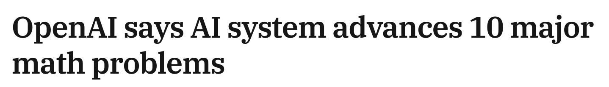
 

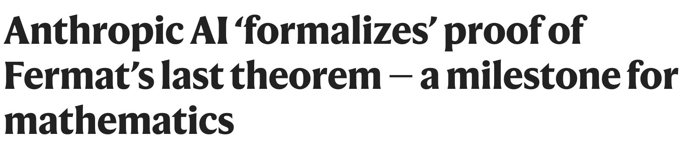
 

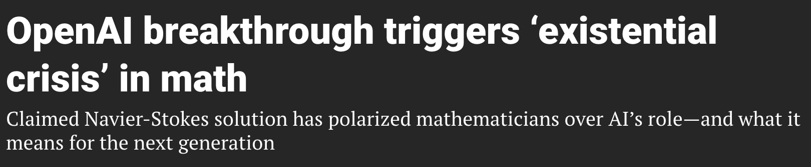
 

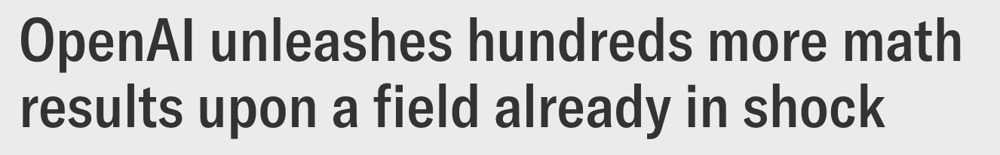
 

---

### Digital Pathology

 
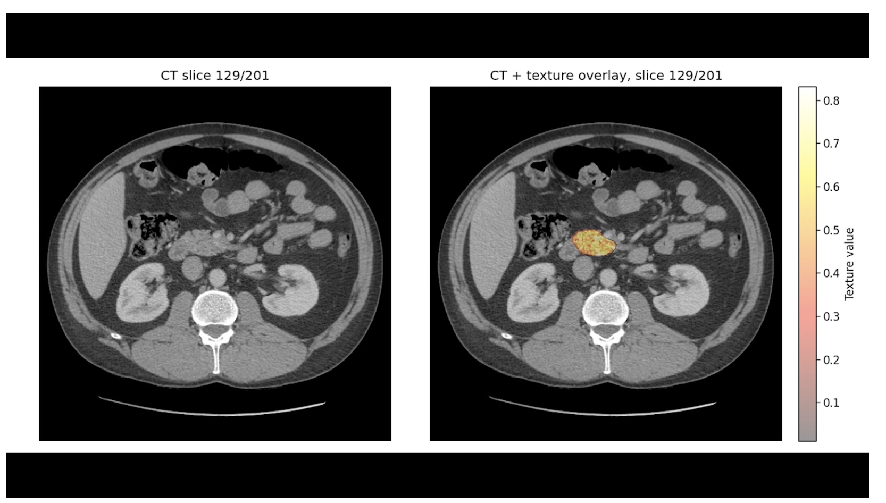
 
 

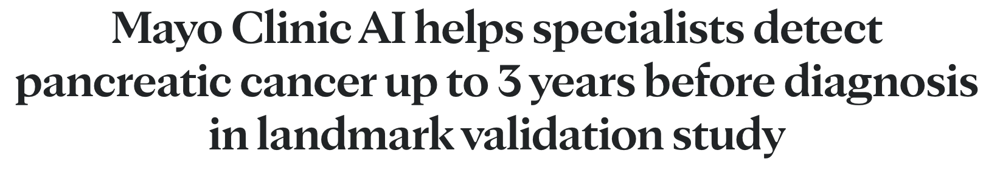
 

<small>
[Image credit](https://newsnetwork.mayoclinic.org/discussion/mayo-clinic-ai-detects-pancreatic-cancer-up-to-3-years-before-diagnosis-in-landmark-validation-study/)
</small>

---

### AI Models in Biology 

.split-50[

.column[
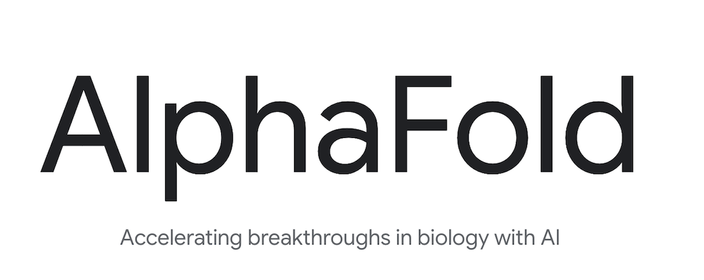

]

.column[
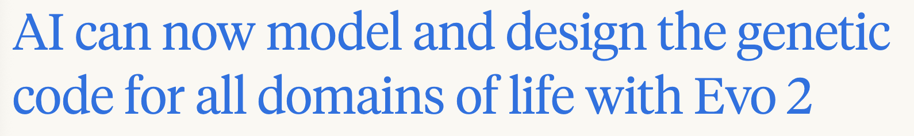
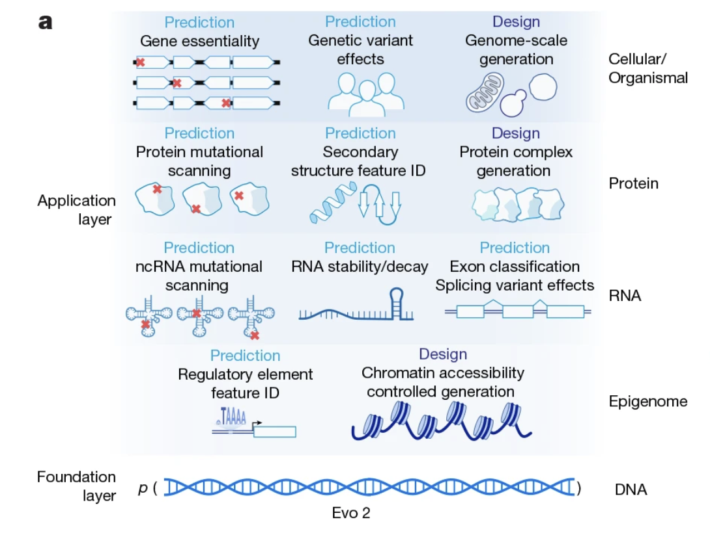
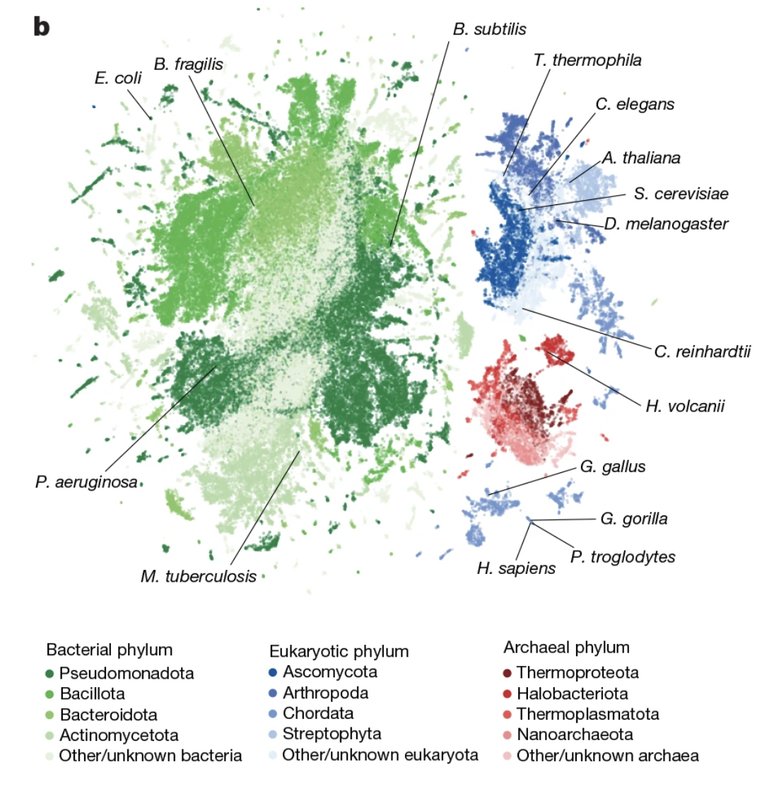
]

]

<small>
Image credits:
[1](https://en.wikipedia.org/wiki/File:Protein_folding_figure.png)
[2](https://www.nature.com/articles/s41586-026-10176-5)
</small>

---

### Drug Discovery

.center[
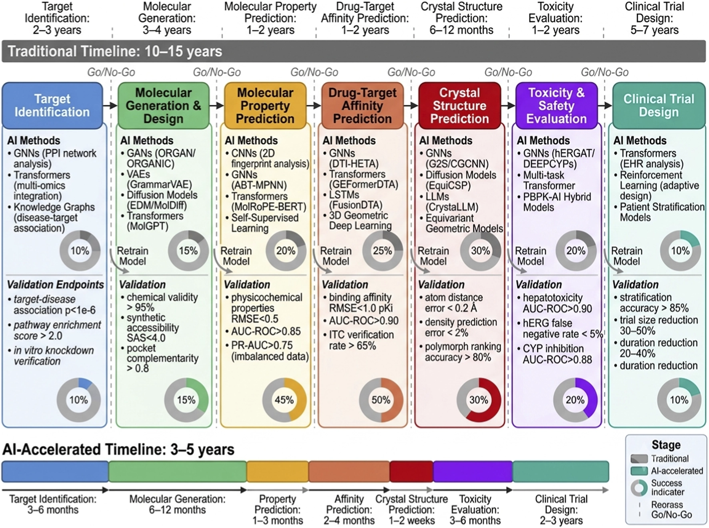
]

<small>
[Image credit](https://www.frontiersin.org/journals/pharmacology/articles/10.3389/fphar.2026.1870527/full)
</small>

---

### Software development

1. __Autocomplete__
*Copilot completions, Cursor tab, JetBrains AI*

2. __Code harnesses__
*Claude Code, Codex CLI, Aider, Cursor agent mode*

3. __Chatbots in software services__
*GitHub Copilot Chat, Copilot Spaces, Slack/Jira assistants*

4. __Automated code review__
*Copilot code review, CodeRabbit, Graphite, Greptile*

5. __Autonomous / async agents__
*GitHub Copilot coding agent, Devin, Jules*

6. __Pipeline & operations__
*Dependabot/CodeQL autofix, Actions log analysis, AIOps tooling*

7. __Documentation generation__

---

### Science

__TODO__: update

- AI-directed experiments

---

### 1. Scientific Applications

## 2. Background / Theory

### 3. Education / Curriculum

---

### Linear regression

.split-60[

.column[

]
.column[
__Data__  
x: input  
y: output  
]

]

---

### Linear regression

.split-60[

.column[

]

.column[
__Data__  
x: input  
y: output  
  
__Model__  
line     
y = mx + b
  
__Parameters__   
m (slope)  
b (intercept)  

__Training / Learning__ 
finding the best parameters - 
minimizing a loss function

]
]

---

### Linear regression

.split-60[

.column[

]

.column[
__Data__  
x: input  
y: output  
  
__Model__  
line     
y = mx + b
  
__Parameters__   
m (slope)  
b (intercept)  

__Training / Learning__ 
finding the best parameters - 
minimizing a loss function

__Overfitting__  
using too many parameters

]
]

---

### Training the model

.split-50[

.column[

]

.column[
__Train the model__  

&nbsp; = learn from data

&nbsp; = find best parameters  

&nbsp; = minimize loss function  

 

__Gradient Descent__  

- give training data to model as input

- calculate gradient of loss function

- adjust parameters in the direction of the gradient

]
]

---

### Neural Networks

.split-60[

.column[

 
 

 
 
 
<small>
Image credits:
[1](https://commons.wikimedia.org/wiki/File:Neuron3.svg)
[2](https://commons.wikimedia.org/wiki/File:Artificial_neuron_structure.svg)
[3](https://commons.wikimedia.org/wiki/File:Colored_neural_network.svg)
</small>

]

.column[
 

.center[
weights == parameters

training == adjusting weights to decrease loss
]

]

]

 

---

### Neural Networks 

.center[

 

__Neural network__   
composition of functions   
(linear transformations / matrix multiplication)

 

__Backpropagation algorithm__  
calculation of gradient   
(chain rule)  

]

<small>
[Image credit](https://www.researchgate.net/figure/Example-of-simple-neural-network-architecture-with-linear-transformation-dense-layer-and_fig2_347965848)
</small>

---

### Computer Vision

.split-50[

.column[

.center[__Training__]

 
 
<small>
Image credits:
[1](https://commons.wikimedia.org/wiki/File:Simplified_neural_network_training_example.svg)
[2](https://commons.wikimedia.org/wiki/File:Simplified_neural_network_training_example.svg)
</small>
]

.column[

.center[__Prediction__]
]

]

---

### Semantic embedding

.split-50[

.column[

 
 
<small>
[Image credit](https://commons.wikimedia.org/wiki/File:Word_vector_illustration.jpg)
</small>

]

.column[
__Embedding__  

mapping of words to vectors in a high-dimensional vector space

__Semantic similarity__   

words with the same meaning have 
- higher cosine similarity 
- shorter distance

__Contextual embedding__

mapping of words depends on its context within a sentence:  

_"Time __flies__ like an arrow, fruit __flies__ like a banana"_

]

]

---

### Large Language Models (LLMs)

__Key advances__

- contextualization of embeddings

- unsupervised pretraining on large bodies of text (parallelizable, scalable)

__History__

- 2017 (Google) "Attention is All you Need": introduces the transformer
  architecture

- 2018 (OpenAI) "Improving Language Understanding by Generative
  Pre-Training": GPT-1 released, using transformer architecture,
  unsupervised pre-training, fine-tuning for downstream tasks

- 2022 (OpenAI) ChatGPT released

- 2022-present Google Gemini, Anthropic Claude, Meta Llama, plus many others

---

### Model, Agent, Harness

- **Model** — the raw LLM

- **Agent** — the program/module that controls all communication with the model
    - maintains context and a run loop for repeated calls to the model
    - handles model output
    - interacts with the user system via _tools_, which allow the agent to
      create files, or search the internet

- **Harness** — the program that manages the agents, for user-defined
    tasks, such as software development

---

### 1. Scientific Applications

### 2. Background / Theory

## 3. Education / Curriculum

---

### Math Curriculum

- __Linear regression__
    - model, parameters
    - training the model using data

- __Linear algebra__
    - vectors
        - dot product
        - projection / cosine similarity
    - matrix multiplication
    - linear transformations

- __Calculus__
    - derivatives
    - minimization / maximization of functions
        - Newton's method
    - multivariable calculus
        - gradients, gradient descent
        - multivariable chain rule 

---

### Science Curriculum

- pencil and paper lessons / activities / quizzes for work on
  conceptual understanding

- hands on activities to connect to the physical world (chemical reactions,
  physics experiments)

- instrument use

- data collection, analysis and visualization

- validation of results

---

### Computer Science Curriculum

- pencil and paper lessons / activities / quizzes, especially for work on
  conceptual understanding

- code validation, unit testing

- debugging

- design / architecture of software systems

---

### Thank you!

.center[

]

 

.center[
Darren Kessner, PhD  
_Program Head of Computer Science and Software Innovation_    
_Marlborough School, Los Angeles_  
]

